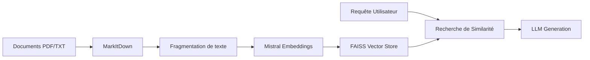

# RAPPORT DE PROJET : CHATBOT INTELLIGENT POUR L'ENSET MOHAMMEDIA
## Système Hybride RAG (Retrieval-Augmented Generation) & SQL

**Réalisé par :**   Hida Mouad , Naouali Houssam, Iliace Bella , Chargaoui Zakaria.
**Établissement :** ENSET Mohammedia  
**Filière :** FI – II-BDCC – 1ère Année  
**Année Universitaire :** 2025 - 2026

---

## 1. SOMMAIRE

1. **Introduction**
    * 1.1 Contexte du Projet
    * 1.2 Problématique
    * 1.3 Objectifs
2. **Technologies & Outils Choisis**
    * 2.1 Intelligence Artificielle (Mistral AI)
    * 2.2 Backend (Python, Flask, LangChain)
    * 2.3 Frontend (Next.js, Tailwind CSS)
    * 2.4 Stockage des données (FAISS & PostgreSQL)
3. **Architecture du Système**
    * 3.1 Vue d'ensemble du système
    * 3.2 Le workflow RAG (Données Non-Structurées)
    * 3.3 Le workflow SQL (Données Structurées)
    * 3.4 Logique de l'Agent Hybride
4. **Étapes de Réalisation**
    * 4.1 Préparation de l'environnement
    * 4.2 Ingestion des documents et Indexation
    * 4.3 Développement de l'interface utilisateur
5. **Défis Techniques & Solutions**
    * 5.1 Extraction précise des emplois du temps
    * 5.2 Gestion de la cohérence des données
    * 5.3 Optimisation sur Windows
6. **Captures d'écran & Démonstration**
7. **Conclusion & Perspectives**
8. **Références**

---

## 2. INTRODUCTION

### 1.1 Contexte du Projet
L'École Normale Supérieure de l'Enseignement Technique (ENSET) de Mohammedia, en tant qu'institution d'excellence, gère une quantité massive d'informations quotidiennes : emplois du temps, programmes pédagogiques, corps professoral, et événements. L'accès rapide à ces informations est crucial pour les étudiants et le personnel administratif.

### 1.2 Problématique
Traditionnellement, les informations sont dispersées dans des bases de données SQL ou des fichiers PDF (emplois du temps). Les étudiants perdent souvent du temps à chercher manuellement ces données. De plus, les systèmes de recherche classiques ne permettent pas de poser des questions en langage naturel ("Quel est mon cours demain à 10h ?").

### 1.3 Objectifs
Le but de ce projet est de concevoir un assistant virtuel capable de :
- Répondre à des questions complexes en utilisant des documents non-structurés (RAG).
- Interroger dynamiquement une base de données relationnelle (SQL).
- Extraire et structurer les emplois du temps sous forme de tableaux lisibles.
- Offrir une expérience utilisateur premium et fluide.

---

## 3. TECHNOLOGIES & OUTILS CHOISIS

### 2.1 Intelligence Artificielle (Mistral AI)
Nous avons choisi **Mistral AI** pour deux raisons majeures :
- **Efficacité linguistique** : Le modèle `mistral-small-latest` offre une excellente compréhension du français et de la logique métier universitaire.
- **Embeddings performants** : `mistral-embed` permet de transformer les documents en vecteurs mathématiques avec une précision de 1024 dimensions, essentielle pour la recherche sémantique.

### 2.2 Backend (Python, Flask, LangChain)
- **Flask** : Pour sa légèreté et sa facilité de mise en place d'APIs REST.
- **LangChain** : Pour orchestrer les interactions entre le LLM, le magasin de vecteurs et la base de données.
- **MarkItDown** : Outil de Microsoft utilisé pour convertir des fichiers PDF, DOCX et MD en texte nettoyé.

### 2.3 Frontend (Next.js, Tailwind CSS)
- **Next.js** : Pour un rendu rapide et une sécurité accrue.
- **Tailwind CSS** : Pour une interface moderne, réactive et "premium".
- **Framer Motion** : Utilisé pour les micro-animations et transitions fluides.

---

## 4. ARCHITECTURE DÉTAILLÉE DU SYSTÈME

### 3.1 Vue d'ensemble Technique
L'architecture adopte un modèle découplé où le Frontend (Next.js) communique via une API REST avec le Backend (Flask). Le cœur de l'intelligence est un "Agent Hybrid" capable d'orchestrer plusieurs sources de données.

### 3.2 Le workflow RAG (Retrieval-Augmented Generation)
Le processus RAG est conçu pour compenser les limites de connaissances statiques du LLM :
1. **Extraction** : Utilisation de `markitdown` pour transformer les PDFs complexes d'emplois du temps en Markdown structuré.
2. **Indexing** : Fragmentation du texte en "chunks" optimisés pour ne pas couper les tableaux au milieu d'une ligne.
3. **Vectorisation** : Conversion de chaque chunk en un vecteur de 1024 dimensions via `mistral-embed`.
4. **Stockage** : Utilisation de **FAISS** (Facebook AI Similarity Search) pour une recherche sémantique ultra-rapide en local.

### 3.3 Le workflow SQL
L'utilisateur pose une question ("Qui enseigne les maths ?"). Le système génère une requête SQL, l'exécute sur PostgreSQL, et renvoie le résultat au format JSON pour être affiché dans l'interface.

---

## 5. ÉTAPES DE RÉALISATION

### 4.1 Préparation de l'environnement
L'installation nécessite une configuration stricte des dépendances Python (Requirements.txt) et la mise en place de variables d'environnement (`.env`) pour sécuriser les clés API.

### 4.2 Ingestion des documents et Indexation
L'étape la plus critique a été l'ajout du support PDF à l'outil `MarkItDown`. Par défaut, l'extraction de tableaux dans les PDFs de planning est complexe. Nous avons configuré une indexation sémantique par blocs (chunks) de 1000 caractères avec un chevauchement de 200 pour ne perdre aucun contexte.

### 4.3 Développement du chat-interface
L'interface a été conçue pour être "humaine". Elle gère les états de chargement, l'historique de conversation, et surtout, les composants UI dynamiques (Tables pour les plannings, Cards pour les profs).

---

## 6. DÉFIS TECHNIQUES & SOLUTIONS

### 5.1 Extraction précise des emplois du temps (Le défi majeur)
Initialement, l'IA "hallucinait" certains cours lorsqu'ils n'étaient pas explicitement trouvés.
- **Solution** : Abaissement de la **Température à 0.1** et injection d'instructions de "Strict Anti-Hallucination".

### 5.2 Optimisation sur Windows
Nous avons rencontré des problèmes d'encodage (Unicode) lors de l'affichage des logs.
- **Solution** : Nettoyage des chaînes de caractères et suppression des symboles non-ASCII dans la couche de communication backend.

---

## 7. CONCLUSION & PERSPECTIVES

Le projet a atteint ses objectifs initiaux en fournissant un outil capable de traiter des requêtes hybrides avec une grande fidélité. Les étudiants de l'ENSET Mohammedia disposent désormais d'un assistant capable de naviguer dans la complexité de leurs plannings.

**Perspectives futures :**
- Intégration de la reconnaissance vocale.
- Système de notifications automatiques pour les changements de salle.
- Application mobile native.

---

## 8. RÉFÉRENCES

- Documentation Mistral AI : [https://docs.mistral.ai/](https://docs.mistral.ai/)
- LangChain Framework : [https://python.langchain.com/](https://python.langchain.com/)
- ENSET Mohammedia Official Site : [https://www.enset-media.ac.ma/](https://www.enset-media.ac.ma/)
